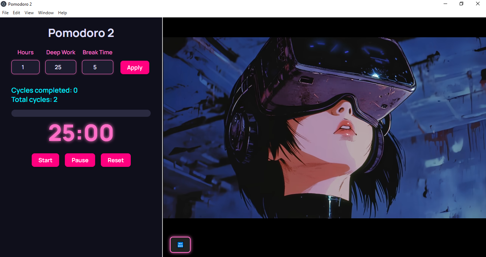

# ⏱️ FocusDek (Pomodoro) – Desktop App with Electron

[](LICENSE)
[](https://github.com/tedevs0)

Desktop application built with **Electron**, works as a standalone runtime for PWAs or productivity tools.  
Ideal for projects with Node.js logic that need a desktop visual layer.

## 🖼️ Screenshot



## 📦 Features 

- 🖥️ Packaged with [Electron](https://www.electronjs.org/)
- 🔒 Security: `contextIsolation: true`, `nodeIntegration: false`
- 🔗 Support for `<webview>` tags

## 🚀 Requirements

- Node.js 18 or higher
- npm or yarn

## ⚙️ Installation

Clone the repository and enter the folder:

```bash
git clone https://github.com/Tedevian/FocusDeck.git
cd FocusDeck
npm install
```

## ▶️ Development Mode

Run the application in desktop mode:

```bash
npm start
```

## 📁 Project Structure

```
pomo2be/
├── index.html           # Main interface
├── main.js              # Electron main process
├── preload.js           # Secure communication between processes
├── package.json
└── ...
```

## 💡 Future Ideas

* 🎨 Theme selector (light/dark mode)
* 🎨 Top bar?
* 🎨 GIF below the buttons
* 🎨 Choose between YouTube or something from the desktop

## 🤝 Contributions

This is an open source project and any contribution is welcome!  
If you have ideas, you find mistakes or want to improve some part, please open an ISSUE or do a Pull Request.

Suggested steps to contribute:

1. Make a repository fork.
2. Create a branch for your improvement or correction.
3. Make your changes and make commit.
4. Open a Pull request explaining your changes.

Thanks for helping to improve FocusDeck!

## 📄 license

This project is licensed under the MIT license. See the [License](License) file for more details.

## ✍️ Author

Created with ❤️ by [Tedevs](https://github.com/tedevs0)